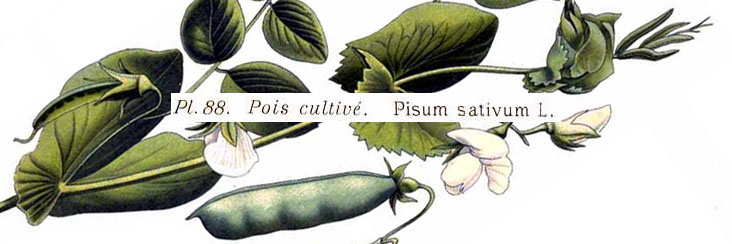

# sativum



This package provides user-friendly wrapper functions for student activities in an introductory biology lab focusing on evolution and genetics.

## Installation

```R
install.packages("devtools")
devtools::install_github("aphanotus/sativum")
library(sativum)
```

## Data sets

- Data from **Mendel**'s original (1866) study of garden peas heredity, including monohybrid, dihybrid and trihybrid experiments.
- Data from **East** (1916) on corolla lengths in tobacco flowers. This dataset is often used in genetics courses to present the effects of selection on quantitative traits. Available in the original (wide) format and a tidy, long format. 
- A dataset including **genome sizes** (in base pairs), predicted gene number, percent G+C content and  haploid chromosome number for more than 500 species.
- Size and gene content of each **human chromosome**.
- Data on beak depth in **Darwin's medium ground finch** (*Geospiza fortis*) from [Boag & Grant 1981](https://doi.org/10.1126/science.214.4516.82).
- Unaligned amino acid sequences from mitochondrial cytochrome c oxidase II (**COII**) for 5 species of vertebrates.
- Unaligned nucleotide sequences from 15 species of **anoles**, including the complete CDS of mitochondrial NADH dehydrogenase subunit 2 (ND2), the complete tRNA-Trp sequence, and partial sequence from tRNA-Ala.
- An **anole phylogeny** based on the ND2-Ala sequences.
- Anole **dewlap phenotype data** from 47 species of anoles. (Table 4 from [Nicholson et al. 2007. *Evolution*](https://www.ncbi.nlm.nih.gov/pmc/articles/PMC1803026/)).
- **Anole natural history data** for 16 species and the related lizard *Leiocephalus barahonensis*, listing their endemic island and ecomorph (from [Nicholson et al. 2007](https://www.ncbi.nlm.nih.gov/pmc/articles/PMC1803026/)).
- Data on **soapberry bug crosses** (from [Fawcett et al. 2018](https://www.nature.com/articles/s41467-018-04102-1)).
- Data on the size and **sternite curvature** of 542 milkweed bugs, *Oncopeltus fasciatus*, with information on sex and RNAi treatment targetting putative sex-determination genes ([Just et al. 2023](https://doi.org/10.1098/rspb.2022.2083)).

> [!TIP]
>
> More datasets are in development, so check back soon!

## Functions for introductory phylogenetics

- `search.for.ncbi.ids`
- `fetch.sequences` 
- `simplify.sequence.names`
- `simplify.names`
- `write.fasta`
- `read.fasta` with output to various formats
- `combine.sequences`
- `align.sequences`
- `write.alignment` - write out an interleaved [Phylip format file](https://en.wikipedia.org/wiki/PHYLIP#File_format)
- `infer.phylogeny` using Neighbor-Joining or UPGMA
- `draw.tree` with some sensible aesthetic parameters, includes the ability to easily color-code tree tips
- `add.branch.lengths` to a tree plot
- `label.clade` with a colored bar and text, based on tip names (rather than node numbers)
- `phylogenetic.distance` finds the totals branch lengths separating two tips on a tree

## Vignettes

- **[phylogenetics-tetrapod-exercise](vignettes/phylogenetics-tetrapod-exercise.pdf)**: A basic introduction to phylogenetics using tetrapods
- **[phylogenetics-anole-exercise](vignettes/phylogenetics-anole-exercise.pdf)**: A more advanced introduction to phylogenetics using anoles

