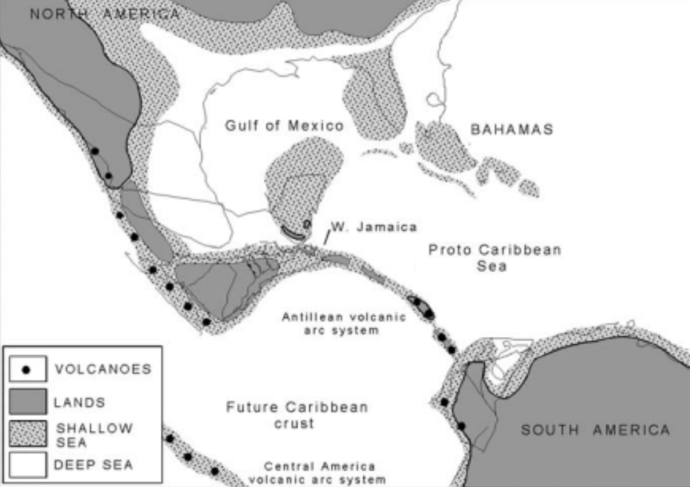

```{r setup, include = FALSE}
options(rmarkdown.html_vignette.check_title = FALSE)
knitr::opts_chunk$set(
  collapse = TRUE,
  warning = FALSE,
  error = FALSE,
  highlight = TRUE,
  indent = "  ",
  comment = ""
)
```

```{r load.packages, include = FALSE}
library(stringr)
library(sativum)
library(ape)
library(Biostrings)
library(rentrez)
library(msa)
library(phangorn)
```

## Objectives

- Learn about hypothesized biogeographical histories of *Anolis* in the Caribbean
- Develop a phylogenetic tree displaying relatedness of anoles using molecular information
- Determine which hypothesis about radiation of anoles is best supported by molecular data - Communicate your findings in a full scientific research paper

## Introduction

The more than 700 islands of the Caribbean are home to about 150 species of anoles, a closely related group of lizards (genus *Anolis*) that occupy diverse habitats and niches (Figure 1). Research on these lizards is enriching our understanding of evolutionary processes, such as adaptation by natural selection, evolution, and the formation of new species—and it is helping to illuminate how and why there are so many different kinds of living organisms on Earth. 

The evolutionary history of these anoles serve as a strong example of **adaptive radiation**, where a type of organism diversifies from a common ancestor to occupy a variety of available niches in the environment. The isolated nature of these islands (for land dwelling organisms) makes evaluating adaptive radiation in this system particularly attractive since complexities brought by mainland communities are reduced. Additionally, a pattern revealed by their radiation into numerous species each occupying a distinct niche is that this radiation pattern is replicated on each island in the Greater Antilles. This brings up a question of when the replicated radiation occurred in their evolutionary history. Did it occur earlier on in geologic history when the islands were interconnected into larger island body known as the Proto-Antilles or later after the islands were their own distinct landmasses? Before pursuing how to explore an answer to that question, first let’s learn more about the geologic history of the landscape.

|     |     |
| --- | --- |
| {height=235px} | {height=235px} |
| *Figure 1.* Diverse anoles share common features. *Anolis cristatellus* is a common anole species found in Puerto Rico. Anole species live in diverse habitats and vary greatly in size and other obvious features such as tail and leg length (Photo by [Janson Jones CC BY-NC](https://www.inaturalist.org/photos/37728705)). | *Figure 2.* Caribbean islands are home to the anoles. The anole species you will be studying in this project live in the islands of Cuba, Jamaica, Hispaniola (Haiti and Dominican Republic) and Puerto Rico (https://www.islandlifecaribbean.com/caribbean-map/) |

## Biogeogrpahy of anoles in the Greater Antilles

If you are to make an informed prediction about the evolution of *Anolis* on these Caribbean Islands, known collectively as the Greater Antilles, you should first have a basic understanding of the history of the formations of the islands themselves (Figure 2). Precursors to some of these the Caribbean Islands, known as the Proto-Antilles, formed in the Pacific Ocean during the Cretaceous Period from 145 to 65 million years ago (Mya) (Figures 3 & 4). 

<center>
{height=350px} 
</center>

> *Figure 3.* Geologic time scale from the Jurassic Period to the present. Ages represent the lower estimate of each epoch.

<center>
{width=700px}
</center>

> *Figure 4.* Paleogeography of the Caribbean in the late Cretaceous (about 70 Mya). Volcanic arcs supported transient islands, repeatedly exposed and drowned, preventing persistent ecosystems. Modified from [Iturralde-Vinent (2006)](https://doi.org/10.2747/0020-6814.48.9.791).

The Proto-Antilles then moved via tectonic plate action from the Pacific Ocean, through the passage between Central and South America, and into the Carribean around 70 mya. The Proto-Antilles continued to move across the Caribbean, often completely submerged under water for periods. It remained connected as a larger landmass up until the Oligocene (27-29 mya, Figure 5) and then were completely separated 14-16 mya. This landmass included Cuba, Hispaniola, and Puerto Rico but Jamaica had a different geologic history. It was connected to Central America until 50 mya and then moved eastward to its current position and was mostly submerged during that period except for isolated montane islands (Losos 2009). 

<center>
{width=700px}
</center>

> *Figure 5.* Caribbean latest Eocene–Early Oligocene paleogeography (35-33 Mya), updated from Iturralde-Vinent and MacPhee (1999). This scenario provides the possibility of terrestrial biota migration from South America into the Aves–Greater Antilles ridge, and also reduces possibilities of marine biotal exchange across the Caribbean Sea. Figure caption and image taken from [Iturralde-Vinent (2006)](https://doi.org/10.2747/0020-6814.48.9.791).

Based on various methods of dating, the first ancestors to modern-day *Anolis* are estimated to have evolved between 66-40 mya on the Proto-Antilles, meaning once the contiguous landmass of the Proto-Antilles had settled into the Caribbean region but long after it passed close to the mainland of Central and South America. Once in this position in the Caribbean, the neighboring Aves Ridge could have connected to South America (Figure 6). Much contention surrounds whether the Aves Ridge could have been a land bridge from mainland South America for emigration. This idea is known as the Gaarlandia hypothesis, and it is still being investigated to this day (Iturralde-Vinent 2006; Ali & Hedges 2021). So although we aren’t sure how the ancestral *Anolis* reached the island (Aves Ridge land bridge or over-water dispersal), we do know the relative timing. 

<center>
{width=750px}
</center>

> Figure 6. This paleogeographic reconstruction of the GAARlandia land bridge shows how it might have appeared 35-33 Mya. ("GAAR" is an acronym for Greater Aves Antilles Ridge.) Yellow shading represents lowlands, and red shading represents highlands. Thin black lines outline the coasts of present-day islands and landmasses ([Ali & Hedges 2021](https://doi.org/10.1111/jbi.14234)).


## Your Study

Another area of debate is what was the order of events that led this singular ancestral line that first colonized the Proto-Antilles to become the amazing variety of Anolis we see on these islands today- in other words, how did the radiation process happen? Your challenge in this project is to use molecular data and bioinformatics tools to evaluate two competing hypotheses about the radiation of anoles on the Greater Antilles. Did the ancestral anole disperse across the Proto-Antilles and radiate while the islands were a large landmass or did the radiation occur once the islands were separated, either by an expanse of ocean or allopatrically by impassable barriers between what would be the distinct island later. Regardless of the pathway, the radiation events led to speciation of multiple representatives of different ecological morphotypes or **ecomorphs**.

**The Research Question**: How did adaptive radiation of *Anolis* occur in the Greater Antilles?

#### Hypothesis 1: Single Origin of Ecomorphs Hypothesis

Ecomorphs radiated from the ancestral population when islands were contiguous on an inter-connected Proto-Antilles. Populations of each type of ecomorph would have dispersed across this contiguous landmass. Later the Proto-Antilles separated into distinct islands, each taking a portion of the population of each ecomorph with it where evolution continued through allopatric means to produce the modern day species.


#### Hypothesis 2: Convergent Evolution of Ecomorphs Hypothesis

Initially there was a common distant ancestor present across the contiguous Proto-Antilles landmass, as in the single-origin hypothesis. The Proto-Antilles broke apart into distinct islands, each taking a portion of the ancestral population with them. Then the ancestral populations on each island independently diversified into the many species that exist today. In this scenario the ecomorphs evolved repeatedly and independently on each of the islands. This situation can be considered a form of **convergent evolution**, where different groups of organisms independently evolve similar traits by adapting to similar environments or ecological niches. 

- Respond to the questions in Parts 1 & 2 below, individually or in a group. If done as group work, be sure each group member has a copy since the responses will be helpful in crafting your research paper associated with this project.

### Part 1: Identifying Ecomorphs and Exploring Anole Adaptive Radiation 

1. **Examine the photographs** of 16 species of anole lizards and sort them on the bench top into as many groups as you want according to how they appear in the photographs. 

2. **Discuss** how you grouped the lizards and your rationale for the various groupings below. If you picked a body feature to sort by, speculate about the advantages or disadvantages of such a body feature in the environment that species occupies. 

3. **Watch** the first part (up until ~09:50) of the film Lizards in an Evolutionary Tree.

4. Now that you have more information about the anoles, **revise** your groupings of your photos and if you wish. You’ve also been provided a photo of a lizard to function as an outgroup, *Leiocephalus barahonensis*. The common name of this species is the Barahona Curly Tailed Lizard and it is found in Haiti and varies between 65-80 mm in length. 

5. Species of Caribbean anoles can be categorized into six groups according to their body characteristics (morphology) and the ecological niches they occupy. The groups are referred to as ecological morphotypes, or ecomorphs. The film discusses four ecomorphs. Additional photo cards identifying those film ecomorphs are provided with average lengths. Did your groupings match the ecomorphs described in the film? **Why or why not?** 

### Part 2: Generating a Phylogeny from DNA Sequences & Revealing Evolutionary Relationships of Anoles

Using available nucleotide sequence data as well as computational tools and techniques you learned about in the tetrapods tutorial, you will evaluate whether a phylogenetic tree you construct using nucleotide sequences data from modern day anoles offers support for the single origin or convergent evolution hypothesis. 

- *Single Origin Hypothesis*: radiation into each ecomorph occurred on the Proto-Antilles landmass
- *Convergence Hypothesis*: radiation into each ecomorph occurred convergently on each of four islands studied

6. Think about how the phylogenetic tree might need to look in terms of who would be most closely related to each other to support each of the hypotheses. For each hypothesis, **make predictions** below as to whether inhabitants of the same island or species from the same ecomorph would be more closely related and thus form their own monophyletic groups. 

#### **Molecular Phylogenetic Methods**

7. **Explore** the starting dataset. The R package `sativum` includes a dataset of anole DNA sequences that we will work with. Load the package using the `library` function.

```
> library(sativum)
```

```{r include=FALSE}
library(sativum)
```

Next, examine the dataset in the `anole.ND2` object.

```
> anole.ND2
```

The sequences below will appear as output in the console.

```{r echo=FALSE}
anole.ND2
```

The object `anole.ND2` includes the DNA sequences of 15 of the 16 *Anolis* species in the photographs. These nucleotide sequences are from a stretch of mitochondrial DNA that includes the *NADH dehydrogenase subunit II* (*ND2*) gene and five tRNA genes (“ND2-tRNAtrp-tRNAala”). These genes are conserved enough among animal species that they can be recognized in distantly related species, yet they are also variable enough that each species has a unique sequence, and that sequence can be compared to that of closely related species to infer their evolutionary relationships. 

Look at the species names in this dataset. 

```
> names(anole.ND2)
```

The list below will appear as output in the console.

```{r echo=FALSE}
names(anole.ND2)
```

In addition to the anoles, one unrelated lizard species, *Leiocephalus barahonensis*, is included as an outgroup to root the tree. (It's the first sequence in the dataset.) The common name of this species is the Barahona Curly Tailed Lizard and it is found in Haiti. 

8. One more anole species, *Anolis sheplani*, needs its sequences added to the dataset. **Go to NCBI** at http://www.ncbi.nlm.nih.gov and **search** for  `Anolis sheplani ND2`. Among the results, find the "Genomes" panel and **click on "Nucleotide"**. You will see the GenBank ID number, `AF055966`,  under the title. It also appears as the Locus and Accession IDs in the GenBank format file below.

To obtain the new sequence, we use the `fetch.sequence` function with the GenBank ID.

```
> sheplani.sequence <- fetch.sequence(ids = "AF055966")
```

This command saves the sequences in the `sheplani.sequence` object and displays an abbreviated version of the sequence as output in the R console. 

```{r fetch, echo=FALSE}
sheplani.sequence <- fetch.sequence(ids = "AF055966")
```


9. **Combine** the two data objects together into a new dataset using the `combine.sequences` function.

```
> (combined.ND2 <- combine.sequences(anole.ND2, sheplani.sequence))
```

This command uses a simple trick in R. By surrounding the entire statement with parentheses it forces the contents of `combined.ND2` to be printed in the R console. (Otherwise the output from `combine.sequences` would not be displayed; just stored in the new object called `combined.ND2`.) 

```{r combine, echo=FALSE}
(combined.ND2 <- combine.sequences(anole.ND2, sheplani.sequence))
```

Notice that the new sequence for *A. sheplani* is now below the original sequence for *A. valencienni*.

10. **Save the dataset** in FASTA format. 

```
> write.fasta(combined.ND2, filename = "combined.ND2.fasta")
```

FASTA is a text-based format commonly used in bioinformatics and genomics. It can represent either nucleotide or amino acid (protein) sequences using single-letter codes. FASTA files are convenient because they can include multiple sequences. Each sequence has a short identifying description, which in this case comes from the name of each row in our dataset.

11. **Align the sequences** using the ClustalOmega algorithm.

```
> anole.alignment <- align.sequences(
>   combined.ND2, 
>   method = "ClustalOmega", 
>   order = "input"
> )
```

This command will provide a short summary of what it did, as shown below.

```{r align.sequences, echo=FALSE}
anole.alignment <- align.sequences(
  combined.ND2, 
  method = "ClustalOmega", 
  order = "input"
)
```

You can look at the full alignment using the commanmd below.

```
> print(anole.alignment, "complete")
```

*The output is not shown here because it's very long!*

12. **Build a phylogeny** using the Neighbor-Joining method.

```
> anole.tree <- infer.phylogeny(anole.alignment)
```

This command will produce a short summary output in the console and plot a phylogeny in the graphics panel.

```{r infer.phylogeny, echo=FALSE, fig.align='center', fig.height=3.5, fig.width=6}
anole.tree <- infer.phylogeny(anole.alignment)
```

We can clean up the names, making them shorter, so we can see the tree topology better. Let's also get rid of the scale bar, since it's running into the base of the tree. Since these are species names, we can also put them in italics - bold italics.

```
> (anole.tree$tip.label <- simplify.names(anole.tree$tip.label))
```

This command will produce the following output in the console.

```{r simplify.names, echo=FALSE}
(anole.tree$tip.label <- simplify.names(anole.tree$tip.label))
```

Then draw the tree again with the shortened taxon names. The command also removed the scale bar using the argument `show.scale.bar = FALSE` and since these are species names we can make the font italics using the argument `tip.font = 4`.

```
> draw.tree(anole.tree, show.scale.bar = FALSE, tip.font = 4)
```

```{r draw.tree.w.short.names, echo=FALSE, fig.align='center', fig.height=3.5, fig.width=6}
draw.tree(anole.tree, show.scale.bar = FALSE, tip.font = 4)
```

13. **Save the tree** you've created in the [Newick format](https://en.wikipedia.org/wiki/Newick_format), a simple and common format used in phylogenetics to store trees.

```
> write.tree(anole.tree, "anole.ND2.tre")
```

14. **Explore how factors group on the tree**. Think about the two hypotheses for anole evolution. What predictions does each hypothesis make for relatedness according to the ecomorphs and island origins of species? We can test those hypotheses by mapping those biological factors onto our phylogenetic tree. 

First, examine the metadata we have regarding the ecomorphs and islands origins for each species. This information is stored in a data frame called `anole.natural.history`.

```
> anole.natural.history
```

The table below should appear in your R console.

```{r anole.natural.history, echo=FALSE}
anole.natural.history
```

Check that this table includes all the species in our tree, and that species are named in the same order as the tip labels in our tree object.

```
> anole.tree$tip.label
```

If the order of the information doesn't match, you will not get the correct answer! 

```{r show.tip.labels, echo=FALSE}
anole.tree$tip.label
```

Okay, so the table is in alphabetical order, except for the outgroup at the top. However our tip labels in the tree data object are in the order we added them. So the last two species do not match!

Thankfully, it's always possible to rearrange the order of rows in the `anole.natural.history` data frame. We'll need to define a temporary object to hold one row while we make the swap.

```
> x <- anole.natural.history[17,]
> anole.natural.history[17,] <- anole.natural.history[16,]
> anole.natural.history[16,] <- x
```

Finally, confirm that you've done it correctly by inspecting the data frame.

```
> anole.natural.history
```

```{r swap, echo=FALSE}
x <- anole.natural.history[17,]
anole.natural.history[17,] <- anole.natural.history[16,]
anole.natural.history[16,] <- x
anole.natural.history
```

Then plot the tree using the argument `tip.groups` to color-code the species by island.

15. **Draw the tree, color-coding species by island.** To evaluate if the species group within the tree by island-of-origin or by ecomorph, we will plot the same tree, layered on information about the species using different colors. 

```
> draw.tree(
>   anole.tree, 
>   tip.groups = anole.natural.history$island,
>   legend.title = "island",
>   show.scale.bar = FALSE, tip.font = 4
> )
```

```{r island.annotation, echo=FALSE, fig.align='center', fig.height=3.5, fig.width=6}
draw.tree(
  anole.tree, 
  tip.groups = anole.natural.history$island,
  legend.title = "island",
  show.scale.bar = FALSE, tip.font = 4)
```

16. **Draw the tree, color-coding species by ecomorph.** We can do the same for the ecomorph data. To distinguish the plots, we'll use a different [color palette](https://cran.r-project.org/web/packages/viridis/vignettes/intro-to-viridis.html#the-color-scales) to label this tree.

```
> draw.tree(
>   anole.tree, 
>   tip.groups = anole.natural.history$ecomorph,
>   legend.title = "ecomorph",
>   tip.color = "magma",
>   show.scale.bar = FALSE, tip.font = 4
> )
```

```{r ecomorph.annotation, echo=FALSE, fig.align='center', fig.height=3.5, fig.width=6}
draw.tree(
  anole.tree, 
  tip.groups = anole.natural.history$ecomorph,
  legend.title = "ecomorph",
  tip.color = "magma",
  show.scale.bar = FALSE, tip.font = 4)
```

17. You can **save these plots** by clicking the "Export" button on the plot panel in Rstudio or by taking a screen-capture. 


#### **Analysis Questions**

Examine the phylogenetic trees you color coded and answer the following questions.

18. What general patterns of organization do you see in the tree that is:

- Colored-coded by island?
<br><br><br><br>

- Colored-coded by ecomorph?
<br><br><br><br>

19. Do species from the same ecomorph or island group together on the tree into the same clade? Provide evidence to support your answer.
<br><br><br><br>

20. Are the genetic distances varied or all similar in length? What is the approximate average?
<br><br><br><br>

21. Watch the rest of the film either in lab or as homework. It will help confirm which hypothesis is supported by the nucleotide data.

#### **Thought Questions**

22. Review the two hypotheses. Which hypothesis is supported by the DNA analysis shown in the tree and how does the color coding help reveal that? Justify your answer and explain your reasoning.

23. What would you imagine the process of evolution looked like from the basal ancestral population prior to Caribbean island formation up through radiation of anole on each island. Describe for the reader so they have a mental picture.

24. Speculate about what may have led to a radiation like this where similar ecomorph classes can be found on each of the different islands in the Caribbean. Why do we have the same replicated radiations on each island?

25. What is the interpretation of the genetic distance and what might the similar values across species indicate about the timing of the radiation event of *Anolis* across the island system?

26. Is there evidence from some of Losos’ modern day anole studies of adaptive radiation and/or convergent evolution in anoles? Describe how that backs up or contradicts the findings you made.

27. Is there evidence from other species of adaptive radiation on islands and how does that connect to what you found?

28. If there are any species that are outliers in terms of where they are located on the tree given which hypothesis you believe is supported, you’d be expected to address this in your Discussion. Examine the relationship between *Anolis sheplani* and *Anolis angusticeps*. Does it support the hypothesis you provided in the question above? Explain your answer. Develop a possible explanation that could explain this relationship.

29. What study might you want to do next with anoles?

## References

Materials taken from Howard Hughes Medical Institute, Biointeractive Resources, Using DNA to Explore Lizard Phenology

Ali, J and B. Hedges. 2021. Colonizing the Caribbean: New geological data and an updated land-vertebrate colonization record challenge the GAARlandia land-bridge  hypothesis. Journal of Biogeography 48:2699–2707.

Iturralde-Vinent, M. 2006. Meso-Cenozoic Caribbean Paleogeography: Implications for the Historical Biogeography of the Region. International Geology Review 48: 791–827.

Losos, J. 2009. Lizards in an Evolutionary Tree: Ecology and Adaptive Radiation of Anoles. UC Press, Berkley, CA. 507.

## Assignment

- Prepare a full paper with an Introduction, Methods, Results and Discussion, Literature Cited sections. Your goal is to address which hypothesis for the research question is supported by the patterns you’ve uncovered in your molecular trees. 

- The write-up should include use of a minimum of five outside sources (some are provided on Moodle in the Literature folder). 

- Not all responses to questions answered above should appear in your paper- only the info that adds to the reader’s understanding of the main question about the origins of anole in Caribbean Islands. For instance, most of Part 1 (Q1-5) will not appear in your Results.

Introduction section should include:

- Background information including what is known as well as gap in knowledge 
- Research question as a statement of purpose
- Two competing hypotheses
- Predictions for trees if each hypothesis was supported  

Methods section should include:

- Study organism subsection about Caribbean anole lizards
- Study Site subsection about Greater Antilles
- Data Collection and Analysis subsection describing Part 2 including the molecular data and its the origins, software used, and any manipulations you made to your trees
- Although the majority of sequences were provided to you for sake of time, you should write the Methods giving directions as if you collected it all yourself.
- Use the table from `anole.natural.history` in your paper if you want to list info about the *Anolis* species.

Result section should include:

- Two molecular trees: one color-coded by ecomorph and one by island of residence.
- Any details about trees or responses to questions in this handout that are appropriate for a Results section (description of tree organization/patterns, placement of species in relation to one another).
- Some responses to your analysis questions above may be addressed in the Results. It is up to you to determine what constitutes material to be included in the Results versus Discussion section.

Discussion section should include:

- Some responses to your thought questions above may be addressed in the Discussion. It is up to you to determine what constitutes material to be included in the Results versus Discussion section.
- Any biological explanation for patterns on phylogeny mentioned in the Results
- Integration of outside sources that relate to the question about origins of anoles
- Any studies illustrating adaptive radiation and/or evolutionary potential when new species introduced to an island
- Studies that investigate adaptive radiation of other organisms on islands

